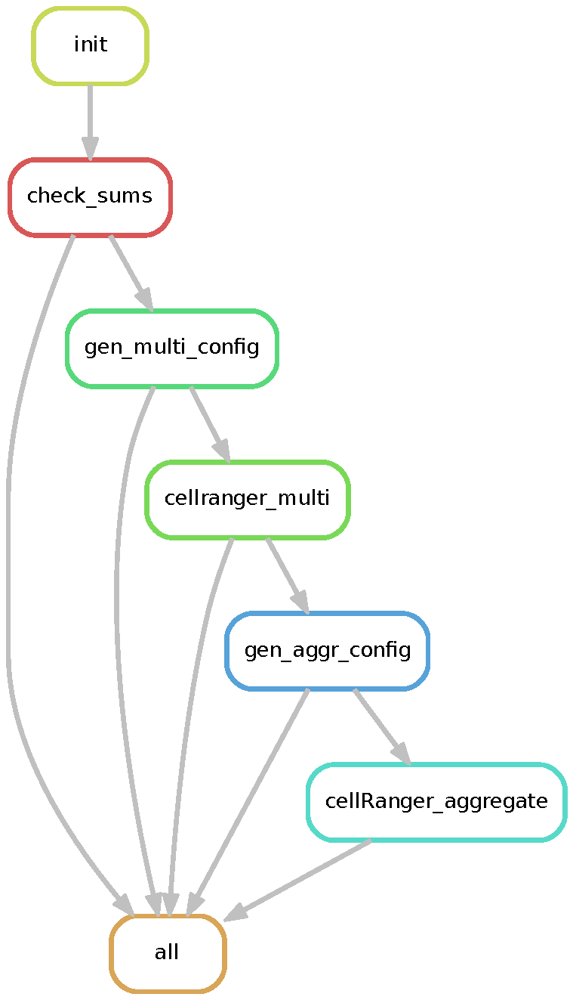

# NGIS Cell Ranger 9 Pipeline

A Snakemake workflow for processing single-cell sequencing data using Cell Ranger 9, designed for reproducible and scalable analysis.

This workflow automates Cell Ranger runs for sequencing data delivered by SciLifeLab National Genomics Infrastructure, and is tailored for use on the Bianca secure HPC cluster at UPPMAX (Uppsala Multidisciplinary Center for Advanced Computational Science).

**Note:** This workflow is compatible only with Cell Ranger experiments containing VDJ, ADT, and 5'/3' GEX libraries (and optionally cell hashing).

---

## Features

- Assures file integrity by MD5 sum
- Automates per-sample generation of Cell Ranger multi-config files
- Automates and parallelizes per-sample Cell Ranger runs
- Automates generation of Cell Ranger aggregate config file
- Runs Cell Ranger aggregate on desired sample runs

<div align="center">
  
</div>
---

## Getting Started

### 1. Clone the Repository and Upload to Bianca

Clone the repository to your local machine:

```bash
git clone https://github.com/JohnBassett-KI/NGIS_cellRanger9.git
```

Upload the repository to Bianca using SFTP (replace `your_bianca_username` and `your_bianca_project`):

```bash
sftp your_bianca_username@bianca.uppmax.uu.se
> cd /proj/your_bianca_project/
> put -r NGIS_cellRanger9
> exit
```

---

### 2. Obtain Cell Ranger 9 Container

The Cell Ranger 9 container is not publicly available due to licensing restrictions.  
Please contact the workflow maintainer to request access or for guidance on building your own container.

---

### 3. Configure SLURM Profile

Edit your SLURM account information:

```bash
vi profiles/slurm/config.yaml
```

Update the following line:

```yaml
  account="YOUR_ACCOUNT"         # replace with your SLURM account (e.g., "sens123456")
```

---

### 4. Configure Your Experiment

Edit `config.yaml` for your experiment:

```bash
vi config.yaml
```

- **Edit paths** to your FASTQ files, references, and output directories as instructed in the file header.

---

### 5. Check Your Configuration

From the `NGIS_cellRanger9` directory, run:

```bash
bash checkrun
```

Inspect the output and ensure that your samples are properly identified.

---

### 6. Run the Pipeline

```bash
bash run
```

---

### 7. Monitor Jobs

```bash
bash monitorjobs
```

---

## Requirements

- [Snakemake](https://snakemake.readthedocs.io/) (tested with version 8.20.1)
- [Apptainer/Singularity](https://apptainer.org/) (Apptainer is provided by Bianca)
- Cell Ranger 9 (not included)
- Python 3.7+
- `rsync`, `bash`, and standard UNIX tools

---

## File Structure

- `Snakefile` – Main workflow
- `config.example.yaml` – Example configuration file
- `profiles/` – Cluster profiles (e.g., SLURM)
- `cellRanger_apptainer/` – Container images (not included)
- `cellRanger_pipe/` – Helper scripts

---


##Version
v0.1.0